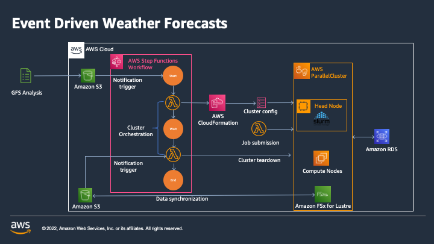
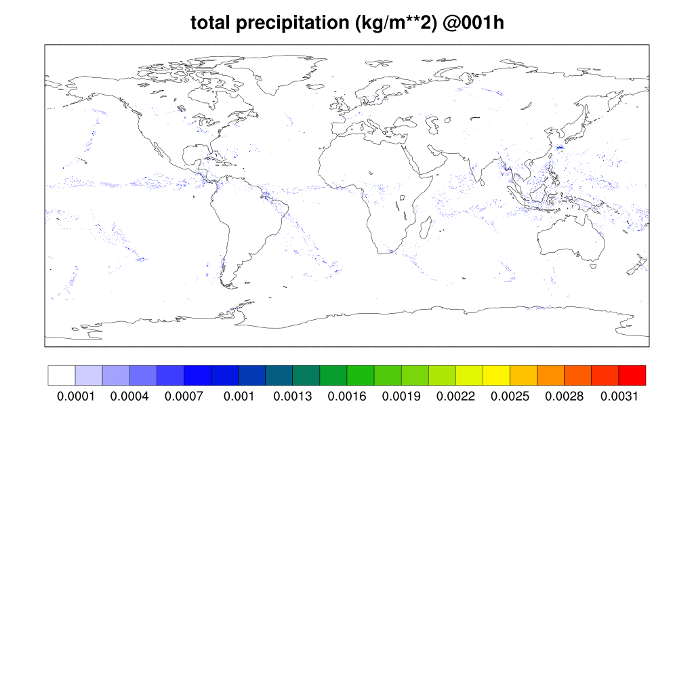
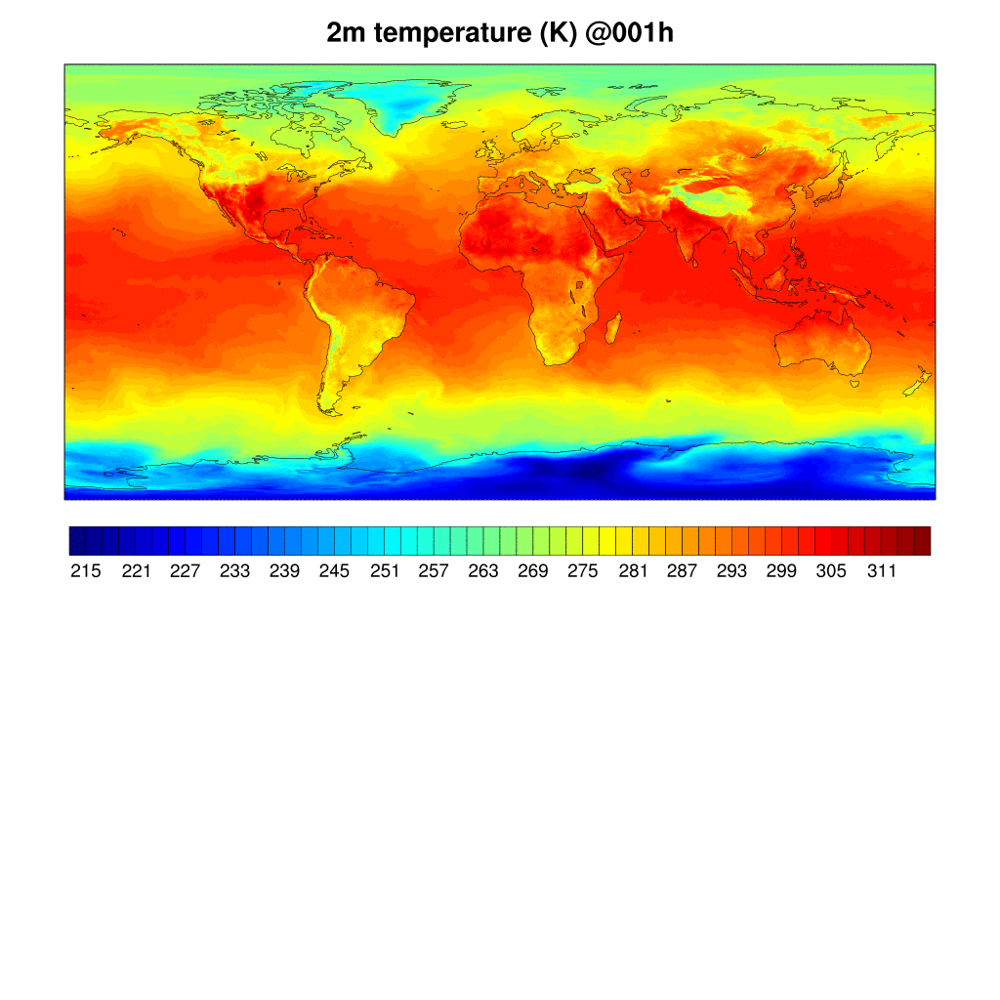

# Event Driven Weather Forecasts



A fully automated cloud-native event driven weather forecasting.

## FV3GFS Forecast

The Unified Forecast System (UFS) atmospheric model is FV3GFS. The UFS is a community-based, coupled, comprehensive Earth modeling system.
The UFS numerical applications span local to global domains and predictive time scales from sub-hourly analyses to seasonal predictions.
It is designed to support the Weather Enterprise and to be the source system for NOAA‘s operational numerical weather prediction applications.
The UFS Weather Model (WM) is a prognostic model that can be used for short- and medium-range research and operational forecasts, as exemplified by
its use in the operational Global Forecast System (GFS) of the National Oceanic and Atmospheric Administration (NOAA).

We are running the FV3GFS for a 6 hour global forecast at a resolution of approximately 13 km (C768).

The forecast consists of the following steps:

1. Preprocessing the input data with `chgres_cube` (~ 3:30 minutes on 20 instances).
2. Model forecast with `ufs_weather_model` (~ 7:30 minutes on 20 instances).
3. Post processing with `upp.x` (~ 13:00minutes on 7 instances).





## Installation

Install the AWS CDK application and the python library.

```
npm install -g aws-cdk
cd src/
python3 -m venv .venv
. .venv/bin/activate
pip install -r requirements.txt
```

## Deploying

Create a lambda layer that contains `requests` and `pyyaml`.
```
mkdir layer && cd $_
pip install requests pyyaml -t python/
zip -r ../layer.zip python
```

Then deploy the CDK stack.

```
cdk bootstrap
cdk deploy
```

## Cleanup

To completely tear down all infrastructure when it is not needed.

```
cdk destroy --all
```

## Repository Layout

All the source code lives under `src`, the main entry point for the CDK application is `app.py`.

```
.
├── README.md
└── src
    ├── app.py
    ├── cdk.json
    ├── lambda
    │   ├── cluster.py
    │   ├── forecast.py
    │   ├── hpc6a.yaml
    │   └── jobs
    │       ├── fini.sh
    │       ├── post.sh
    │       ├── pre.sh
    │       └── run.sh
    ├── layer.zip
    ├── layers
    ├── requirements-dev.txt
    ├── requirements.txt
    ├── resources
    │   ├── parallelcluster-api.yaml
    │   ├── post_install_headnode.sh
    │   ├── spack-external-packages.yaml
    │   ├── ufs-image-config.yaml
    │   └── ufs-spack-component.yaml
    └── wx
        ├── bucket.py
        ├── forecast.py
        ├── network.py
        ├── pclusterapi.py
        └── slurmdb.py
```
### Lambda

The cluster creation and deletion functions are within the `lambda/cluster.py` file, with the ParallelCluster configuration file is `lambda/hpc6a.yaml`.

The forecast job submission functions are within the `lambda/forecast.py` file.

### S3 Bucket

The S3 bucket contains all the run directory, outputs, and templates used. The top-level bucket structure is as follows:

```
└── aws-weather-bucket
    ├── outputs
    ├── run
    └── templates
```

The `outputs` directory contain prefixes related to the forecast valid time (`%Y/%m/%d/%H`).

### Slurm

The Slurm jobs are submitted through the [Slurm REST API](https://slurm.schedmd.com/rest.html) with inter job dependencies. The job run scripts are within the `lambda/jobs` directory and are:

1. `pre` -- [UFS Utils](https://github.com/ufs-community/UFS_UTILS) `chgres_cube`.
2. `run` -- [UFS Weather Model](https://github.com/ufs-community/ufs-weather-model/) `ufs_weather_model`.
3. `post` -- [UPP](https://github.com/NOAA-EMC/UPP) `upp.x`.
4. `fini` -- Uploads a sentinel file to Amazon S3.

## Custom EC2 Image.

We are going to create a custom ParallelCluster EC2. In doing so we will install the following packages with [Spack](https://github.com/spack/spack).

* [Intel OneAPI Compilers](https://www.intel.com/content/www/us/en/developer/tools/oneapi/toolkits.html)
* [Intel OneAPI MPI Libraries](https://www.intel.com/content/www/us/en/developer/tools/oneapi/toolkits.html)
* [UFS Weather Model](https://ufs-weather-model.readthedocs.io/en/latest/)
* [UFS Utilities](https://noaa-emcufs-utils.readthedocs.io/en/latest/ufs_utils.html)
* [Unified Post Processor](https://dtcenter.org/community-code/unified-post-processor-upp)

A custom component to install these packages exists in `src/resources/ufs-spack-component.yaml`.
This needs to be deployed to our bucket.
```
aws s3 cp src/resources/ufs-spack-component.yaml s3://aws-weather-bucket/templates/
```
Once deployed we need to register it with EC2 ImageBuilder.
```
aws imagebuilder create-component --name ufs-spack --semantic-version "1.0.0" \
    --change-description "Inital version" --platform "Linux" \
    --uri "s3://aws-weather-bucket/templates/ufs-spack-component.yaml"
```

Build the new image
```
cd src/resources
pcluster build-image --image-configuration ufs-image-config.yaml --image-id alinux2-ufs-image
```

Once the image is built, get the AMI identification number and add this to the ParallelCluster configuration file.
```
export AMI=$(pcluster list-images --image-status AVAILABLE | jq -r '.[][] | select(.imageId=="alinux2-ufs-image") | .ec2AmiInfo.amiId')
yq e '.Image.CustomAmi = env(AMI)' -i ../lambda/hpc6a.yaml
```

## License
This code is licensed under the MIT-0 License. See the LICENSE file.
